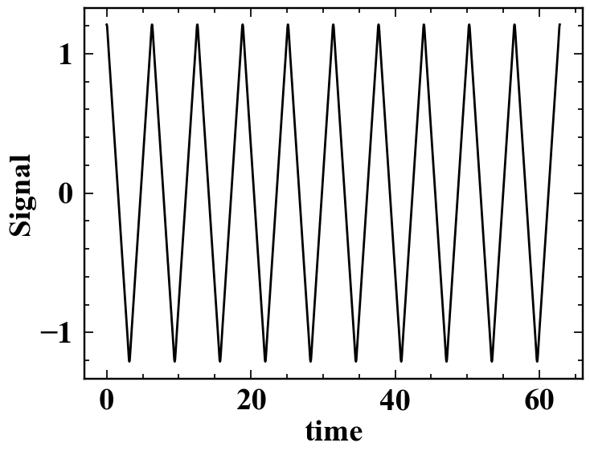
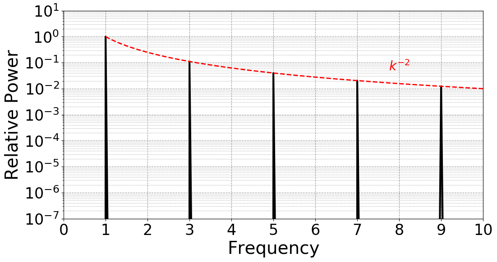

In this section we will take all that we learned thus far and build on
it to run software on [Sol](https://sol.asu.edu). We will demonstrate
some of the basics of interacting with the supercomputer and scheduler
through the command line, such as using the module file system or using
the `interactive` command.  We are going to take the commands we repeat
frequently and save them in files that can be submitted to compute nodes
for asynchronous completion.  

## Software on the Sol supercomputer
> The Sol supercomputer was 
> [ranked #388 in the World as of June, 2023](https://www.top500.org/lists/top500/list/2023/06/?page=4). 
> Sol provides significant computational resources to many researchers
> at Arizona State University, each with unique, domain-based software
> requirements that may even vary from research project to project.
> As a result, it is best to keep Sol's initial shell environment as
> simple and generic as possible, and used specialized,
> administrator-provided tools to load in software dependencies specific
> to each computational workflow. 

We will begin by first examining the example workflow that we will be
working with. 

~~~
$ cd ~/Desktop/data-shell/signal
$ ls
~~~
{: .language-bash}

~~~
fft.png  get_fft.py  my_signal_processing_job.sh  signal.dat  signal.png
~~~
{: .output}

In this example, we will be working with some time series data,
specifically that associated with a 
[triangle wave](https://en.wikipedia.org/wiki/Triangle_wave).  The time
series `signal.png` is shown below:

The data associated with this triangle wave is included in `signal.dat`,
and the first ten lines will be outputted to the terminal with `head`:

~~~
$ head signal.dat
~~~
{: .language-bash}

~~~
time                     signal
0.000000000000000000e+00 1.208721311121388364e+00
6.283185307179586614e-03 1.208524005375646748e+00
1.256637061435917323e-02 1.207933122945394233e+00
1.884955592153875897e-02 1.206951758516047635e+00
2.513274122871834645e-02 1.205585037553673411e+00
3.141592653589793394e-02 1.203840068169563127e+00
3.769911184307751795e-02 1.201725874483989820e+00
4.398229715025710196e-02 1.199253312231516322e+00
5.026548245743669291e-02 1.196434967546847306e+00
~~~
{: .output}

A Python file is already provided to compute the 
[discrete Fourier transform](https://en.wikipedia.org/wiki/Discrete_Fourier_transform) 
of these data, and may be viewed carefully with `nano` or safely with
the read-only pager `less`. The python file requires several modules
including `numpy` and `pylab`, which are not accessible without
appropriately modifying our environment. To demonstrate this, output the
`$PATH` environment variable:

~~~
$ echo $PATH
$ which python
~~~
{: .language-bash}

~~~
/home/rcsparky/.local/bin:/usr/local/bin:/usr/bin:/usr/local/sbin:/usr/sbin

/usr/bin/python
~~~
{: .output}

Note that this **environment variable** contains directories delimited
by a colon character. These are the directories, or **paths**, that the
shell searches for executables when given a command to run. That is, in
the above example, the shell looks for an executable called `echo` first
in `~rcsparky/.local/bin` before checking `/usr/local/bin`, where the
latter is where `echo` is first found. Python exists as an executable by
default on Linux systems, as it is useful and often used for system
administration. By running `which python`, the first instance of
`python` as an executable within the specified `$PATH` is shown:
`/usr/bin/python`. However, on Sol, the correct **module** file has to
be loaded to properly set up the shell environment to access the correct
scientific python. That is,

~~~
$ module load mamba/latest
$ echo $PATH
$ which python
~~~
{: .language-bash}

~~~
=====================================================================
This module is intended solely for building or source activating user
python environments, i.e.,

    mamba create -n myenv -c conda-forge <package_list>

or

    source activate myenv

To list available environments, run:

    mamba info --envs

See our docs: https://links.asu.edu/solpy

Any other use is NOT TESTED.
=====================================================================

/packages/apps/mamba/1.2.0/bin:/home/rcsparky/.local/bin:/usr/local/bin:/usr/bin:/usr/local/sbin:/usr/sbin

/packages/apps/mamba/1.2.0/bin/python
~~~
{: .output}

When the `mamba/latest` module is loaded, among other background
updates, the environment `$PATH` is updated so that a new python
executable and its libraries are found by the shell first:
`/packages/apps/mamba/1.2.0/bin/python`. However, this base environment
should also not be used for computational research tasks. `mamba` is a
python package manager that can be used to create custom python
environments (see [Sol's documentation on mamba for
details](https://links.asu.edu/mamba), which are beyond the scope of
this shell lesson). When `mamba/latest` was module loaded, a help-text
blurb was printed out which reflected that the module is intended solely
for building or activating user python environments. The python
environment `scicomp` is an administrator maintained, mamba-created
software environment that may be used for common computational research
tasks, such as reading or writing datafiles, or doing visualization.

~~~
$ source activate scicomp
(scicomp) $ echo $PATH
(scicomp) $ which python
~~~
{: .language-bash}

~~~
/packages/envs/scicomp/bin:/packages/apps/mamba/1.2.0/condabin:/packages/apps/mamba/1.2.0/bin:/home/rcsparky/.local/bin:/usr/local/bin:/usr/bin:/usr/local/sbin:/usr/sbin

/packages/envs/scicomp/bin/python
~~~
{: .output}

> ## Required steps to use python for computational research, in summary
> 1. Load the python package manager: `module load mamba/latest`
> 2. Activate the appropriate environment, e.g., `source activate
>    scicomp`
> If the appropriate environment needs to be built, use `mamba` to
> create the environment and install all computational dependencies [as
> detailed in our documentation](https://links.asu.edu/mamba).  Note
> that when a python environment is source activated, the shell prompt
> is prefixed with the parenthetical name of that environment. 
{: .callout}

> ## Module Environments
>
> To see a list of loaded modules, use `module list`. To see all modules
> available on Sol, use `module avail` or refine your search to the
> software you are interested in by adding it as an additional argument,
> e.g., `module avail matlab`. To see more details about what a module
> actually does, try `module show <name of module>`.
{: .callout}

So far, everything we have done has been on a head node, e.g.,
`login01`.  The head node is provided mostly for managing compute rather
than actively computing. On the head node, you are limited to a small
set of actions, such as managing the file system, compiling software, or
editing software. The main purpose of the node is to prepare, submit,
and track work conducted through the SLURM scheduler. One of the
simplest ways to actually get to a full compute environment is to use
the system administrator provided command: `interactive`.

~~~
$ cd ~/Desktop/data-shell/signal
$ interactive -t 15
~~~
{: .language-bash}

Note that the `-t 15` option passed to `interactive`. This asks for a
15-minute allocation somewhere on the supercomputer.  By default,
`interactive` will request one core for four hours on one of Sol's nodes
within the general partition. To increase the likelihood of being
immediately scheduled, we can decrease the time being asked for to
something more practical, i.e., `-t 15`.  Once the interactive job
begins on a compute node, you will be automatically connected. Your
prompt should reflect this, changing from 
`[username@head_node_hostname:~/Desktop/data-shell/signal]$` to
`[username@compute_node_hostname:~/Desktop/data-shell/signal]$`. In the
above example, `rcsparky` was scheduled on `c002`. To explore this
compute node, consider the following commands:

~~~
$ hostname # prints the compute node's hostname
$ nproc    # prints the number of processors (cores) available
$ free -h  # shows the amount of RAM available and its use on the node in
           # human readable format
$ pwd      # prints the working (current) directory
$ lscpu    # prints more detailed information about the cpu hardware
~~~
{: .language-bash}

~~~
c002.sol.asu.edu 
1
              total        used        free      shared  buff/cache   available
Mem:          503Gi        13Gi       483Gi       2.7Gi       6.5Gi       484Gi
Swap:         4.0Gi       1.7Gi       2.3Gi
/home/rcsparky/Desktop/data-shell/signal
Architecture:        x86_64
CPU op-mode(s):      32-bit, 64-bit
Byte Order:          Little Endian
CPU(s):              128
On-line CPU(s) list: 0-127
Thread(s) per core:  1
Core(s) per socket:  64
Socket(s):           2
NUMA node(s):        8
Vendor ID:           AuthenticAMD
CPU family:          25
Model:               1
Model name:          AMD EPYC 7713 64-Core Processor
Stepping:            1
CPU MHz:             3093.695
BogoMIPS:            3992.37
Virtualization:      AMD-V
L1d cache:           32K
L1i cache:           32K
L2 cache:            512K
L3 cache:            32768K
NUMA node0 CPU(s):   0-15
NUMA node1 CPU(s):   16-31
NUMA node2 CPU(s):   32-47
NUMA node3 CPU(s):   48-63
NUMA node4 CPU(s):   64-79
NUMA node5 CPU(s):   80-95
NUMA node6 CPU(s):   96-111
NUMA node7 CPU(s):   112-127
Flags:               fpu vme de pse tsc msr pae mce cx8 apic sep mtrr
pge mca cmov pat pse36 clflush mmx fxsr sse sse2 ht syscall nx mmxext
fxsr_opt pdpe1gb rdtscp lm constant_tsc rep_good nopl nonstop_tsc cpuid
extd_apicid aperfmperf pni pclmulqdq monitor ssse3 fma cx16 pcid sse4_1
sse4_2 x2apic movbe popcnt aes xsave avx f16c rdrand lahf_lm cmp_legacy
svm extapic cr8_legacy abm sse4a misalignsse 3dnowprefetch osvw ibs
skinit wdt tce topoext perfctr_core perfctr_nb bpext perfctr_llc mwaitx
cpb cat_l3 cdp_l3 invpcid_single hw_pstate ssbd mba ibrs ibpb stibp
vmmcall fsgsbase bmi1 avx2 smep bmi2 invpcid cqm rdt_a rdseed adx smap
clflushopt clwb sha_ni xsaveopt xsavec xgetbv1 xsaves cqm_llc
cqm_occup_llc cqm_mbm_total cqm_mbm_local clzero irperf xsaveerptr
wbnoinvd amd_ppin arat npt lbrv svm_lock nrip_save tsc_scale vmcb_clean
flushbyasid decodeassists pausefilter pfthreshold v_vmsave_vmload vgif
v_spec_ctrl umip pku ospke vaes vpclmulqdq rdpid overflow_recov succor
smca sme sev sev_es
~~~
{: .output}

## Lightwork
> If you are planning on doing light interactive work, like compiling
> code or building a python environment, working on a homework problem,
> or developing/debugging a program, an alternative command
> `aux-interactive` will connect you to one of two dedicated `lightwork`
> nodes. These sessions are meant to always start quickly and by default
> ask for one core for one hour.
{: .callout}

Let's run the python `fft` script from this interactive session. All we
need to do is set up the appropriate environment and run the script.

~~~
$ module load mamba/latest   # reset the environment 
$ python get_fft.py          # run the python code
~~~
{: .language-bash}

The result is `fft.png`, demonstrating the expecting Fourier spectra of
the triangle wave:

> ## The interactive command
>
> The command `interactive` is really a bash wrapper around SLURM's
> provided scheduler command ,`sbatch`. On Sol, `interactive` has the
> following defaults:
> - partition: `general`
> - qos: `public`
> - walltime: `0-4` (4 hours)
> - cores: 1
> - output: `/dev/null` (output messages are thrown away)
> - error: `/dev/null` (error messages are thrown away)
> The defaults, as indicated, may be customized by passing the appropriate
> `sbatch` options. A full list may be obtained through the manual page: `man
> sbatch`, but a few common alternatives are indicated here:
> - specify `htc` partition: `-p htc`
> - specify `public` qos: `-q public`
> - specify four hour wall time (max for this partition): `-t 0-4` or
>   `-t 240` or many other ways
> - specify four cores: `-c 4`
> - specify one GPU: `-G 1`
> - specify output file:  `-o <path>`
> - specify error  file:  `-e <path>`
> This will be examined in more detail in the `sbatch` section.
{: .callout}

After a while of getting comfortable with interactive sessions, you may
find yourself wishing there was a way to automate your actions. The good
news is that your workflow is likely fully scriptable, and that it just
requires a bit of scheduler wrapping to successful batch process. We
will use the previous example to demonstrate with the file
`data-shell/signal/my_signal_processing_job.sh`, which contains:

~~~
#!/bin/bash
#SBATCH -p general
#SBATCH -q public
#SBATCH -t 5
#SBATCH -c 1
#SBATCH -e signal_processing_job.%j.err
#SBATCH -o signal_processing_job.%j.out
#SBATCH --mail-type=ALL
#SBATCH --export=NONE

# Grab node information if desired (note a lot of this is recorded by
# slurm already)
echo hostname: $(hostname)
echo    nproc: $(nproc)
echo     free: $(free -h)
echo      pwd: $(pwd)
# Load required software
module load mamba/latest
source activate scicomp
# Diagnostic information
module list
which python
# Put bash into a diagnostic mode that prints commands
set -x
# Starting
echo STARTED: $(date)
# Run scientific workflow
python get_fft.py
# Finished
echo FINISHED: $(date)
~~~
{: .language-bash}

To submit this job, use `sbatch` (submitted as user jyalim):

~~~
$ sbatch my_signal_processing_job.sh
~~~
{: .language-bash}

~~~
Submitted batch job 9483816
~~~
{: .output}

The **job id** that `sbatch` reports is a unique integer associated with
your job. This job id may be used to track the status of the job in the
queue with a variety of commands, such as `myjobs`, a wrapper around the
scheduler-provided program `squeue` that provides a filter for just your
jobs:

~~~
$ myjobs
~~~
{: .language-bash}

~~~
  JobID  PRIORITY     PARTITION/QOS  NAME                           STATE  TIME  TIME_LIMIT  Node/Core/GPU    NODELIST(REASON)
9483816     99693  lightwork/public  my_signal_processing_job.sh  PENDING  0:00        5:00  1/1/NA           (None)

~~~
{: .output}

or for more detailed information, `thisjob <jobid>`,

~~~
$ thisjob 9483427
~~~
{: .language-bash}

~~~
JOBID      PARTITION NAME               USER           STATE        TIME         TIME_LIMIT   CPUS  NODELIST(REASON
9483816    lightwork my_signal_processi jyalim         PENDING      0:00         5:00         1     (None)

JobId=9483816 JobName=my_signal_processing_job.sh
   UserId=jyalim(513649) GroupId=grp_jyalim(99999988) MCS_label=N/A
   Priority=99693 Nice=0 Account=grp_jyalim QOS=public
   JobState=PENDING Reason=None Dependency=(null)
   Requeue=1 Restarts=0 BatchFlag=1 Reboot=0 ExitCode=0:0
   DerivedExitCode=0:0
   RunTime=00:00:00 TimeLimit=00:05:00 TimeMin=N/A
   SubmitTime=2023-08-22T17:39:00 EligibleTime=2023-08-22T17:39:00
   AccrueTime=Unknown
   StartTime=Unknown EndTime=Unknown Deadline=N/A
   SuspendTime=None SecsPreSuspend=0 LastSchedEval=2023-08-22T17:39:00 Scheduler=Main
   Partition=lightwork AllocNode:Sid=slurm01:2436840
   ReqNodeList=(null) ExcNodeList=cg00[1-5],fpga01a,fpga01i,g[230-239],g0[01-50]
   NodeList=
   NumNodes=1 NumCPUs=1 NumTasks=1 CPUs/Task=1 ReqB:S:C:T=0:0:*:*
   ReqTRES=cpu=1,mem=2G,node=1,billing=1
   AllocTRES=(null)
   Socks/Node=* NtasksPerN:B:S:C=0:0:*:* CoreSpec=*
   MinCPUsNode=1 MinMemoryCPU=2G MinTmpDiskNode=0
   Features=public DelayBoot=00:00:00
   OverSubscribe=YES Contiguous=0 Licenses=(null) Network=(null)
   Command=/home/jyalim/Desktop/data-shell/signal/my_signal_processing_job.sh
   WorkDir=/home/jyalim/Desktop/data-shell/signal
   StdErr=/home/jyalim/Desktop/data-shell/signal/signal_processing_job.9483816.err
   StdIn=/dev/null
   StdOut=/home/jyalim/Desktop/data-shell/signal/signal_processing_job.9483816.out
   Power=
   MailUser=jyalim@asu.edu MailType=INVALID_DEPEND,BEGIN,END,FAIL,REQUEUE,STAGE_OUT
~~~
{: .output}

Note that `myjobs` is roughly equivalent to `squeue --me` (the formatted
outputs are different).

When scheduling jobs, it can be useful to gauge the activity on the
supercomputer. The command-line program `ns` will provide a quick
color-coded overview of partition status:

~~~
$ ns
~~~
{: .language-bash}

Green is used to indicate a full node is available within the partition,
with varying colors reflective of varying availability or node status.
For instance, red reflects that a node is fully allocated, whereas gray
indicates that a node is offline. The first line in each box gives the
short hostname of the node on the supercomputer, the second provides the
number of cores that are allocated by the scheduler out of the system's
total cores, and the presence of a third line indicates GPU
availability, using a ratio similar to the second line for our
GPU-sliced nodes or empty (idle) and filled (allocated) circular
symbols.

Another useful resource is the [status page](https://links.asu.edu/sol-status).

> ## Cancelling jobs
>
> The SLURM command `scancel` is one of the more important scheduler
> commands to know. In its simplest application, you may pass the job
> ids you would like to cancel, e.g. `scancel 4967966`. However,
> `scancel` can accept options to cancel all jobs associated with
> username, partitions, qos, state,and more.  For instance, if issued by
> the user, `scancel --me` would cancel all jobs associated with that
> user. See `man scancel` for more details.
{: .callout}

> ## Job Efficiency 
>
> To better understand how your job is utilizing resources as it is
> running, you can use `ssh` to connect to allocated compute nodes and
> run programs like `htop`. This view will detail how much RAM or how
> many cores your jobs are utilizing (RES and CPU% columns in the
> process table). After a job has finished running, the scheduler can
> report on efficiency as well. Using `seff <jobid>` on a completed job
> will provide a simple summary of maximum RAM utilized relative to the
> amount requested as well as the amount of CPU utilized relative to
> number of cores requested. As Sol is a shared resource, it is
> important to keep your computational work as efficient as practically
> possible! *Before submitting large batches of work, be sure to tune
> your allocations to best match your requirements!*
{: .callout}
