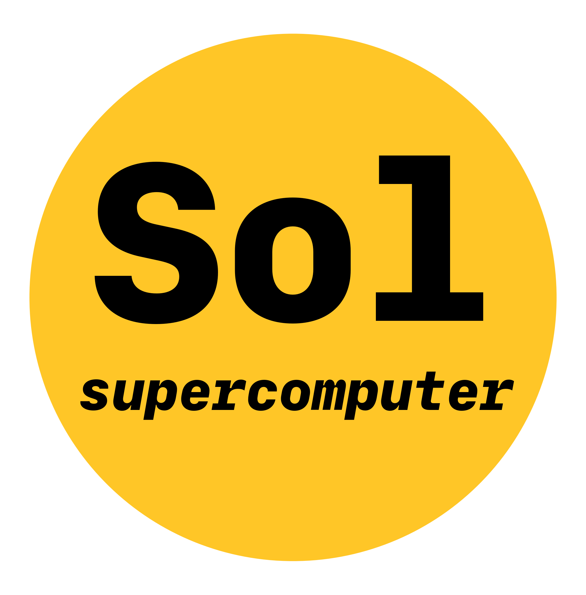

 

  
 

The Unix shell has been around longer than most of its users have been
alive.  It has survived so long because it is a power tool that allows
people to do complex things with just a few keystrokes.  More
importantly, it helps them combine existing programs in new ways and
automate repetitive tasks so they aren't typing the same things over and
over again.  Use of the shell is fundamental to using a wide range of
other powerful tools and computing resources (including
"high-performance computing" supercomputers).  These lessons will start
you on a path towards using these resources effectively on ASU's Sol
supercomputer.

> ## Prerequisites
>
> This lesson guides you through the basics of file systems and the
> shell, with a particular emphasis on the ASU high-performance
> supercomputer: Sol.  If you have stored files on a computer at all and
> recognize the word "file" and either "directory" or "folder" (two
> common words for the same thing), you are ready for this lesson.
>
> If you are already comfortable manipulating files and directories,
> searching for files with `grep` and `find`, and writing simple loops
> and scripts, you may be interested in these additional materials
> provided by the Software Carpentries on Unix (i.e. MacOS) shell
> tricks:
> [shell-extras](https://carpentries-incubator.github.io/shell-extras/).
{: .prereq}
